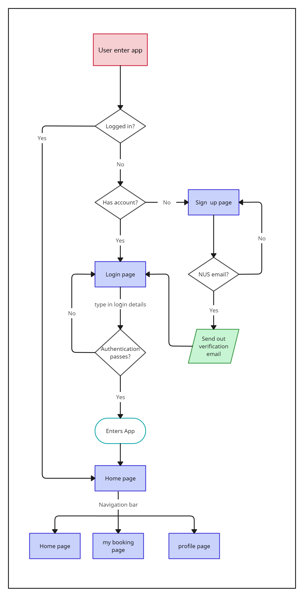
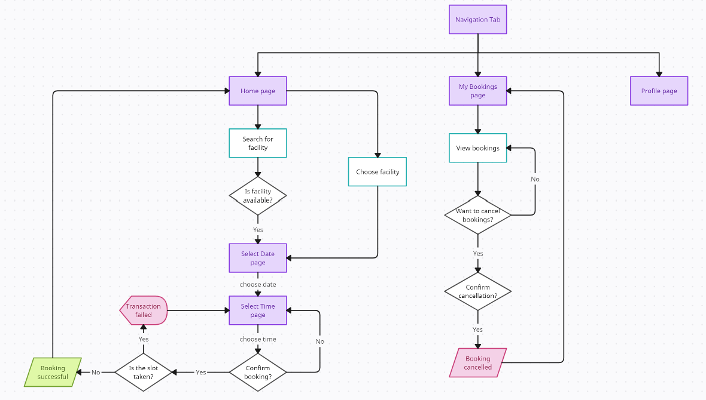
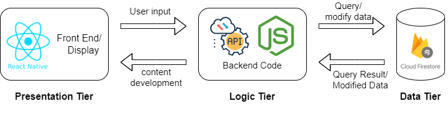

# GetUrSpace

>>>>>  gd2md-html alert:  ERRORs: 0; WARNINGs: 0; ALERTS: 13.

<ul style="color: red; font-weight: bold"><li>See top comment block for details on ERRORs and WARNINGs. <li>In the converted Markdown or HTML, search for inline alerts that start with >>>>>  gd2md-html alert:  for specific instances that need correction.</ul>

Links to alert messages:
<a href="#gdcalert1">alert1</a>
<a href="#gdcalert2">alert2</a>
<a href="#gdcalert3">alert3</a>
<a href="#gdcalert4">alert4</a>
<a href="#gdcalert5">alert5</a>
<a href="#gdcalert6">alert6</a>
<a href="#gdcalert7">alert7</a>
<a href="#gdcalert8">alert8</a>
<a href="#gdcalert9">alert9</a>
<a href="#gdcalert10">alert10</a>
<a href="#gdcalert11">alert11</a>
<a href="#gdcalert12">alert12</a>
<a href="#gdcalert13">alert13</a>

>>>>> PLEASE check and correct alert issues and delete this message and the inline alerts.

## NUS Orbital Project

#### Team Name

Hack Wizards

#### Proposed Level of Achievement

Apollo 11

#### Deployment

To test the app, please download the expo go mobile app. You can scan the QR code or use the link to run the app in expo go. For ios users, please log in to the testing account on the expo go app.

Testing account:
Username: bottester
Password: Botpassword1234

  

Link: exp://exp.host/@bottester/app?release-channel=default

Please note that Microsoft 365 may block the verification emails sent to the registered email account. To solve this issue, you may want to add the domain: [noreply@geturspace-7d0f5.firebaseapp.com](mailto:noreply@geturspace-7d0f5.firebaseapp.com)  to the safe sender list.

#### Motivation

The motivation behind developing a facility booking mobile app for the university stems from students' current challenges in booking facilities. The existing process involves sending emails to check availability, often leading to delays and inconvenience. Students have to wait for responses, sometimes for days, only to discover that the desired facility is unavailable. This reliance on manual labour causes inefficiencies and wastes valuable time for students and staff. Automating the booking process through a mobile app would streamline the entire system, making it more efficient and user-friendly.

#### Aim

The aim of the facility booking mobile app is to simplify and streamline the process of booking facilities for university students. The app will provide a centralised platform where students can quickly check the availability of various facilities and make reservations seamlessly. Automating the process eliminates the need for manual email exchanges and reduces delays in securing bookings. The app will provide real-time information on facility availability, allowing students to make informed decisions and book facilities conveniently at their preferred time slots.

#### Vision

The vision for the facility booking mobile app is to create a user-friendly and efficient platform that revolutionises how students book university facilities. The app will empower students with the ability to view and book available facilities with ease, eliminating the frustrations of the current system. By providing a seamless and automated booking process, the app aims to save time for both students and staff, enabling them to focus more on their academic pursuits. The ultimate vision is to enhance the overall student experience by offering a convenient and reliable tool for facility booking, contributing to a more efficient and productive university environment.

#### User Stories

General users:

1. As a new user, I want to create a new account.
2. As an existing user, I want to log in with my email and password.
3. As a student who stays on campus, I want to be able to check for the facilities of my hall/ house/ RC that I can book. (show a list of facilities that belong to his/her group in the app only and not irrelevant facilities from other places)
4. As a student who stays on campus, I want to be able to check for the availability of the facilities of my hall/ house/ RC quickly so that I know when to book it.
5. As a student, teaching assistant or professor who needs an empty corner to revise for exams or conduct a consultation, I want to be able to book a room or learning pod instantly.
6. As a user, I want to see the list of facilities I have booked, with the relevant details.
7. As a user, I want to get a notification reminding me of the facilities I have booked near the time of booking.

Admins:

1. As an admin, I want to add users to the group I control. (e.g., I should be able to add them to the PGPR group if I am the PGPR admin)
2. As an admin, I want to add facilities that are available for booking in my group. (e.g., RC4 admin should be able to customise the list of facilities that are available at RC4)
3. As an admin, I want to set rules on how users in my group can make bookings. (e.g., can only book the same facility once/twice a week or once a month, or how early in advance can the users make the bookings)
4. As an admin, I want to see the list of bookings made at the facilities under my group. (this is for verification purposes if they need to verify the users at the facilities)
5. As an administrator who wants to prevent abuse of the system, I want to be able to identify abusers (non-NUS students) and ban them from using the application.

###
#### Users Features

##### User Account Authentication

###### [Completed]

###### Description

Each user will need to be authenticated with his/her own NUS email, as GetUrSpace is a personalised booking app. Since it is for booking NUS facilities, there will only be one sign-in method using NUS email and password.

Utilising the Firebase SDK Authentication, users are able to:

* Create an account using his/her NUS email
* Verify their email address
* Log in via email and a password
* Reset password (a password reset link will be sent to their NUS email)

The relevant call to the Firebase authentication instance is made based on the user's action. For instance, registering with email and password calls createUserEmailAndPassword. The FirebaseAuthExceptions are handled within a try-catch block, and a pop-up notification is displayed when the user keys in an invalid input.

###### **Implementation Philosophy**

Within the rootNavigator, an authentication listener constantly checks whether the user is signed in. When users first enter the mobile application, the controller will check if the user is logged in.

If the user is logged in, he/she will be directed to the Facilities page.

If the user is not logged in, he/she will be directed to the Login page to key in his/her details for their existing user profile. Else, the user will be brought to the Register page to register an account. Upon registration, users will be prompted to verify their email through the verification email sent to their registered email address. Only after verifying their email can they log in to the app with the registered email.

We have also implemented error handling for erroneous inputs for the different text input fields in the registration process, and a pop-up notification will appear on the screen to describe what the user should do instead when a given input is invalid.

###### Implementation Challenges

For user authentication, the verification email sent to the NUS email may be blocked sometimes as it may be labelled as spam by Microsoft 365. Hence, users may have to whitelist or unblock the email address. Alternatively, we may also customise the email authentication domain to avoid these issues in the future. Currently, we will just manually whitelist the email address [noreply@geturspace-7d0f5.firebaseapp.com](mailto:noreply@geturspace-7d0f5.firebaseapp.com) just for testing.

Additionally, we want users to verify their email addresses before logging in to ensure the authenticity of users, preventing users from faking an email address to make bookings that they are not supposed to. However, firebase does not have this functionality and even logs in users automatically after registration. To go around it, whenever a user registers an account or attempts to log in, we will check if the user has verified their email address with auth.currentUser.emailVerified. If it returns false, we will call auth.signOut() to sign out users from the firebase side, else we update the user state in the rootNavigator, which will then log the user into the app and redirect to the facility page. 

###### Authentication Flow diagram 

##### Groupings

###### [Completed]

###### Description

Groups are used to represent venues or places. Each group has its own set of facilities, users and admins, and can be managed by the respective group admins. (more in the admin section) 

Groups will be created by us to ensure the authenticity of the groups in the app. Afterwards, admins can be added to manage the facilities.

Users can be added to different groups by admins, enabling them to book facilities specific to those groups. Users can view and select facilities available within their assigned groups on the facilities page. For example, a student residing in PGPR can request to be added to the PGPR group, granting them access to the list of facilities under the PGPR category. Users can only see facilities associated with the groups they belong to. 

The profile page also displays the list of groups that users are affiliated with.

###### Implementation

When users are added to a group, their userID is stored in an array under the “users” field within the group document. Additionally, the user document stores information about the group, such as the group ID, name, and the facilities’ IDs and names within that group. This duplication of data facilitates faster data retrieval from Firestore, reducing delays during page rendering.

###### Challenges

Initially, all data is stored separately in a normalised manner across different documents. While the user's name and email could be quickly accessed from the Firestore ‘auth.currentUser’ on the profile page, retrieving group names required separate queries to Firestore. This involved querying for the list of group IDs and, for each group, querying for the list of facility names. Consequently, there was a slight delay in displaying the group information on the profile page compared to other sections. To address this, the database was modified to adopt data denormalisation, enabling faster data retrieval.

##### Bookings - Make Bookings

###### [Completed]

###### Description

On the Facilities page, users can view all the facilities available for booking. Different users may see a different list of facilities, depending on which group they are under. Groups are determined by which residence users are staying in NUS. 

Users can either scroll and select the facility they want or search for it. After choosing the facility they want to book, they will be directed to the Select Date page, where they will select the date they want to use the facility. Clicking on the “Continue” button at the end of the page after selecting a date will bring them to the Select Time page. Users can choose which facility number and the timing they want. Each time slot is 1hr long, and facilities are available for booking from 8 am to 11 pm. Booking will be successfully confirmed if the slot is not taken upon clicking “Book Now”, else users will have to reselect their time slots.

###### Implementation Philosophy

Booking involves the facilities, date and time screens and they form the facilities stack. Each screen keeps a copy of the booking object, fills up some information and passes it down to the next screen as the booking continues. The booking object contains the user id, facility id, facility name, group id, group name, date, time and facility number. Once the booking is successful at the end of the time page, this information will be written as a new document in the bookings collection and be used to update the bookings field of the facility’s document.

On the date page, we use the React Native calendar, with the minimum date set to the current Singapore date. While on the time page, we have buttons for each time slot, excluding the booked timings taken from the onSnapshot queries from the bookings collections.

To deal with the problem when more than one user try to book for the same slot simultaneously, we use the Firestore transactions functions, a set of atomic read and write operations on one or more documents. 

When the user presses the book button after selecting the time slot, we will call the runTransaction function and read the facility document the user is trying to book. It then checks if the facility contains bookings on the same date, time and facility number prior to this booking. If true, there will be a pop-up message telling the user that the slot has been taken; else, we will proceed to write all the information into the facility document and the new document in the booking collection. In this process, if any edits are made to the document, Cloud Firestore retries the transaction and all the conditions will be rechecked. This ensures that bookings are only made with up-to-date and consistent data, and no two users can book the same facility at the same time slot.

###### Implementation Challenges

Firestore transactions are mainly to resolve data contention when multiple users try to write to existing documents. However, since the bookings to be made are new and we store them in a new document in the bookings collection, there is no direct way to use transactions. We could query from bookings collections to check for matching fields using the booking details, but using transactions with query requires admin sdk. 

We choose another approach, by storing some booking information in the facility to be booked. The bookings field of the facility document is a nested object, storing an array of facility numbers under a date and time field. (see an example of a facility document below) This may be complex, but it allows us to use transactions on the facility document and check if the same facility has been booked while writing to this document. Another benefit is that it helps to reduce the number of queries as we only need to check for one facility document now.

###### Example of a Facility Document

###### Bookings Flow Diagram

##### Bookings - Display and Cancel Bookings

###### [Completed]

###### Description

Each user can track their bookings from the My Bookings page. The bookings made by the user previously will be arranged in chronological order. Other than viewing the bookings they have made, users can also cancel the bookings made at any point in time if they cannot make it for that scheduled slot by clicking on the “Cancel” button at the bottom right corner of each booking. They will be prompted to confirm the cancellation, and the booking list will be updated without the removed booking. Then the slot will be released, and other users can book that slot.

Upon the end time of the booking, the booking list will be updated, with the expired booking being removed automatically. 

###### Implementation Philosophies

Bookings are all stored in the booking collection, and we do a query to find bookings with matching user IDs. We then use the onSnapshot listener to listen to any updates in the bookings collection that gives a different result from the query. Once there are any changes to the query result, we update the bookings state stored on the bookings page. The bookings state is used to map each booking to a BookingItem, a rectangular box that displays the booking information. 

Then cancel button in the BookingItem will call deleteDoc and updateDoc in Firestore, to delete the booking document in the bookings collection and to remove the facility number from the specific date and time in the bookings field of the facility document. This change will trigger the onSnapshot query listener, updating the bookings state with the new query result, hence updating the page with a new list of bookings.

###### Cancellation Flow Diagram

##### Bookings - Notification

###### [Proposed]

###### Description

The app will notify users of any existing bookings that a user has 24 hours before the start of the booking in the form of a phone notification.

#### Admin Features

The app should assist the existing booking processes and preserve the amount of control the admins currently have on the booking system. Therefore, admin accounts may have extra functions in the app.

Admins will first register an account as a user and send an email to the owner of the app to request admin rights. This step is necessary to ensure that the admins are the legitimate management team of the facilities in NUS. We will then change the role of the user to admin from the Firestore directly and our app will render a slightly different user interface based on the admin role.

##### Admin - Manage Users

###### [Proposed]

###### Description

It allows the admin to add or remove users from the groups they oversee efficiently. This functionality ensures that new students can book facilities under specific groups, such as their place of residence while departing students have their access revoked. By implementing this feature, security in the booking process is enhanced compared to traditional methods, and the admin saves time by eliminating the need to manually verify email senders’ identities.

There should be a button to add individual users to the group and the ability to add a batch of users in one go based on students’ email. This is because admins may have the information about the emails of students belonging to their groups, and they will be able to use the existing information without having to collect extra information or take extra steps just to add users to the group.

##### Admin - Manage Facilities

###### [Proposed]

###### Description

The feature allows the admin team to effectively manage the rules and settings associated with each facility within the booking system. By defining specific limits and configurations, admins can ensure that users adhere to booking constraints and prevent exceeding predefined restrictions.

The facilities page should resemble that of the user one. Clicking on a particular facility allows admins to view and modify the rules associated with that facility.

Admins have the ability to set rules for each facility, such as the maximum number of hours a user can book or the number of days in advance users can make bookings. By defining these limits, admins can ensure fair usage of facilities and prevent users from exceeding their allocated time or booking too far in advance.

Admins also have the flexibility to rename facilities if desired. This feature allows for easy customisation and ensures that facility names align with the organisation's requirements or naming conventions.

##### Admin - Manage Bookings

###### [Proposed]

###### Description

The feature empowers the admin with authority to overwrite existing bookings and block off dates or times for events or group bookings. Admins can ensure compliance with regulations and exercise control over the booking process.

The system provides a dedicated booking management page for administrators. This page displays the list of bookings for all facilities under the admin's group, enabling admins to view and review bookings made by users. Administrators can cancel bookings if they deem them unauthorised or violating the established guidelines.

#### Overall Navigation Flow

#### Wireframe

#### Database Model

###### Descriptions

We use the Firebase Firestore as our database, which is a NoSQL, document-oriented database. Data is stored in documents, which are organised into collections. Each document contains key-value pairs and even sub-collections. 

In our database, we do not have any subcollection so that we can access or query documents more efficiently. In some documents, we also have arrays to store the ids of documents from other collections to allow for easier querying of information. This may be similar to the relationships in other SQL databases.

As Firestore recommends the denormalisation of data, we store some frequently accessed data in other collections. For example, the groups and facilities data are also stored in the user documents for faster queries on the profile and facilities pages. Bookings documents also contain some information about the facility and groups to prevent additional queries from other collections and documents.

Documents in the facilities collection also have the bookings field, which stores a nested object {date: {time: [facilityNumbers],...}, …}. While this field has a complex data structure, it is mainly to facilitate the transactions function from Firestore, ensuring there is no same booking written to the database at the same time. 

###### Example of a Facility Document

###### Evaluation

While denormalisation of data allows for easier queries, data updating becomes slower and more troublesome. However, in most cases, the duplicates of data stored in other documents are mostly information that is usually not modified. For example, group names and facility names are stored in both users and bookings documents. This allows for much faster and easier data reading, which is more significant as users may need to browse the facilities and bookings pages often. On the other hand, updating of group names and facility names rarely occurs. It is reasonable to sacrifice the performance of rarely occurred events for the more common operations, hence the decision to make these data denormalised. 

#### Tech Stack

1. React Native (Frontend)
2. Firebase, Firestore (backend)

#### Software Design Pattern

##### Hooks

Most of our react components that require business logic uses the react useEffect hooks to separate the logic from the view being rendered, making the code easier to understand. 

##### Stateful and stateless components

In most pages where many smaller items need to be rendered repeatedly, we break them down into smaller components and store them in separate files. This prevents the repetition of code and allows for higher reusability.  

Additionally, the main screens are mostly stateful, keeping track of the data needed to render the page. On the other hand, the smaller sub-components are mostly stateless, with the required info passed in as props from the main pages containing it. This allows the business logic to remain in the screens and only update the states in the main screens, and the smaller components can still be reused with greater clarity. For example, on the facilities page and mybookings page, they both maintain some states, including the data needed in the smaller sub-components. We then extract the data from the states and pass in the required information as props to the facilityItem and bookingItem, respectively.

#### Software Architecture

##### N-Tier Architecture style

#### Software engineering practices

##### Verison control

We use Git for version control on the local machine and GitHub for the remote server. Both of us create a side branch locally based on the main branch on GitHub and work on different parts of the project separately. Once we reach a certain part of the completion, we will push our branch to the remote server. If the side branch we create works, we create a pull request. Our partner will check the code and decide whether or not to merge. After the merge, the side branches are deleted, and the other partner will pull from the merged code to update the local version.

##### GitHub Issues

Git Issues were used to keep track of any open issues or existing bugs within the app. Tags

were also included to help identify the type of issue, be it fixes or potential enhancements. Only when the problem has been resolved will the issue be closed.

##### Security Measures

To tighten the access to our API, FireBase Authentication and Firestore database, key information such as the private keys and tokens are kept hidden in a .env file. By including the file inside .gitignore, it is not uploaded to the remote master branch when committing changes. Hence, preventing any unauthorised changes to the database.

##### Agile Methodology

Our project, GetUrSpace, follows the agile methodology for development. We organise our work into one-week sprints. Each sprint is a time-boxed period during which we focus on completing a set of tasks and delivering a working increment of the product. By working in short iterations, we can quickly gather feedback, make adjustments and continuously improve the product. At the beginning of each sprint, we conduct a sprint planning meeting. During this meeting, we review the progress of the previous sprint, discuss any challenges or issues encountered, and assess whether the project is on track in terms of timeline and goals. We define the set of tasks to be completed within the sprint and determine their priority. For every sprint, we define clear goals that align with the overall project objectives. These goals provide direction and focus for us throughout the sprint. To achieve these goals, we break them down into smaller, manageable user stories. User stories describe the desired functionality from the end user's perspective, allowing us to prioritise and track progress effectively.

#### User Testing

We have conducted some user testing on potential users, NUS students who may want to book for facilities. In each user testing, we gave them a few tasks to try out, with minimal guidance, and try to obtain feedback on the following questions:

* User-friendliness: How user-friendly the app is/ how easy it is to achieve a specific task
* Intuitiveness: How intuitive it is to navigate to the specific page/ function to perform a specific task
* Smoothness: How smooth the experience is when using the app (experience any lags/ app hangs/ takes too long for something to load)

<table style="width: 100%">
    <colgroup>
       <col span="1" style="width: 15%;">
       <col span="1" style="width: 70%;">
       <col span="1" style="width: 15%;">
    </colgroup>
  <tr>
   <td>
    User Stories
   </td>
   <td>Task
   </td>
   <td>Feedback
   </td>
   <td>Improvements to be made
   </td>
  </tr>
  <tr>
   <td>As a new user, I want to create a new account
   </td>
   <td>Creating account
   </td>
   <td>User-friendliness: Satisfactory

Intuitiveness: Satisfactory

Smoothness: Satisfactory
   </td>
   <td>Keying in a long password can result in overflowing to 2nd line and out of textbox
   </td>
  </tr>
  <tr>
   <td>As an existing user, I want to log in with my email and password
   </td>
   <td>Log in to the app
   </td>
   <td>User-friendliness: Satisfactory

Intuitiveness: Satisfactory

Smoothness: Satisfactory
   </td>
   <td>
   </td>
  </tr>
  <tr>
   <td>As a student who stays on campus, I want to be able to check for the facilities of my hall/ house/ RC that I can book
   </td>
   <td>See the groups
   </td>
   <td>User-friendliness: Satisfactory

Intuitiveness: Satisfactory

Smoothness: Satisfactory
   </td>
   <td>
   </td>
  </tr>
  <tr>
   <td>As a student who stays on campus, I want to be able to check for the availability of the facilities of my hall/ house/ RC quickly so that I know when to book it
   </td>
   <td>See the list of facilities he can book
   </td>
   <td>User-friendliness: Satisfactory

Intuitiveness: Satisfactory

Smoothness: Satisfactory
   </td>
   <td>There is a slight lag when selecting different facilities on the facilities page
   </td>
  </tr>
  <tr>
   <td>As a student, teaching assistant or professor who needs an empty corner to revise for exams or conduct a consultation, I want to be able to book a room or learning pod instantly
   </td>
   <td>Book any facility
   </td>
   <td>User-friendliness: Satisfactory

Intuitiveness: Satisfactory

Smoothness: Satisfactory
   </td>
   <td>There is a slight lag when selecting date on the date page
   </td>
  </tr>
  <tr>
   <td>As a user, I want to be able to see the list of facilities that I have booked, with the relevant details
   </td>
   <td>See the bookings made.

Cancel bookings.
   </td>
   <td>User-friendliness: Satisfactory

Intuitiveness: Satisfactory

Smoothness: Satisfactory
   </td>
   <td>Good to have a notification for upcoming bookings.
   </td>
  </tr>
</table>

#### Development plan

<table>
  <tr>
   <td>S/N
   </td>
   <td colspan="2" >Tasks / Description
   </td>
   <td>In Charge
   </td>
   <td>Date
   </td>
  </tr>
  <tr>
   <td>1
   </td>
   <td colspan="2" >
<ol>

<li>Finalise idea/ tech stack to use

<li>Familiarise with the tech stack (e.g. Git, JavaScript, React Native) and  database (Firebase)
</li>
</ol>
   </td>
   <td>Chao Ming

Shang Kun
   </td>
   <td>8 – 14 May
   </td>
  </tr>
  <tr>
   <td>2
   </td>
   <td colspan="2" >
<ol>

<li>Design our app, use Figma to design the user interface and different pages

<li>Connecting the project to Firebase for user authentication.

<li>Write out the user stories
</li>
</ol>
   </td>
   <td> Chao Ming

Shang Kun
   </td>
   <td>15 – 21 May
   </td>
  </tr>
  <tr>
   <td>3
   </td>
   <td colspan="2" >
<ol>

<li>Ensure smooth login or registration for users

<li>Perform user interface improvements
</li>
</ol>
   </td>
   <td>Chao Ming

Shang Kun
   </td>
   <td>22 - 28 May
   </td>
  </tr>
  <tr>
   <td colspan="4" >Evaluation Milestone 1: Ideation 

- Ideation 

- Proof-of-concept:
   </td>
   <td>29 May
   </td>
  </tr>
  <tr>
   <td>4
   </td>
   <td colspan="2" >
<ol>

<li>Implement a working logical control flow (Main page and Navigation page)

<li>Ensure user data can be added and retrieved from the database 
</li>
</ol>
   </td>
   <td> Chao Ming

Shang Kun
   </td>
   <td>29 May – 4 June
   </td>
  </tr>
  <tr>
   <td>5
   </td>
   <td colspan="2" >
<ol>

<li>Build the booking page/ facilities page

<li>Reflect the available and unavailable timings to users 
</li>
</ol>
   </td>
   <td>Chao Ming

Shang Kun 
   </td>
   <td>5 – 11 June
   </td>
  </tr>
  <tr>
   <td>6
   </td>
   <td colspan="2" >
<ol>

<li>Implement a working algorithm that is able to identify and classify correlated fields

<li>Learn about system testing and trying them out
</li>
</ol>
   </td>
   <td> Chao Ming 

Shang Kun
   </td>
   <td>12 – 18 June
   </td>
  </tr>
  <tr>
   <td>7
   </td>
   <td colspan="2" >
<ol>

<li>Refine user interface and user experience

<li>Test algorithm extensively and rectify bugs if any 
</li>
</ol>
   </td>
   <td>Chao Ming

Shang Kun 
   </td>
   <td>19 – 25 June
   </td>
  </tr>
  <tr>
   <td colspan="4" >Evaluation Milestone 2: Prototype 
<ul>

<li>Essential features

<li>System testing

<li>Documentation 
</li>
</ul>
   </td>
   <td>26 June
   </td>
  </tr>
  <tr>
   <td>8
   </td>
   <td colspan="2" >
<ol>

<li>Gives admin rights to cancel bookings

<li>Allow admin to see who made bookings at specific places.
</li>
</ol>
   </td>
   <td>Chao Ming

Shang Kun

 
   </td>
   <td>26 June – 2 July
   </td>
  </tr>
  <tr>
   <td>9
   </td>
   <td colspan="2" >
<ol>

<li>Improve on the existing algorithm to deal with 

<li>Allow users to filter according to  location and categories of facilities
</li>
</ol>
   </td>
   <td>Chao Ming 

Shang Kun 
   </td>
   <td>3 – 9 July
   </td>
  </tr>
  <tr>
   <td>10
   </td>
   <td colspan="2" > buffer
   </td>
   <td> 
   </td>
   <td>10 – 16 July
   </td>
  </tr>
  <tr>
   <td>11
   </td>
   <td colspan="2" >
<ol>

<li>Refine user interface and user experience

<li>Test algorithm extensively and rectify bugs if any
</li>
</ol>
   </td>
   <td>Chao Ming 

Shang Kun 
   </td>
   <td>17 – 23 July
   </td>
  </tr>
  <tr>
   <td colspan="4" >Evaluation Milestone 3: Extension  
<ul>

<li>Add more useful features

<li>Perform system/ user testing

<li>Document System
</li>
</ul>
   </td>
   <td>24 July
   </td>
  </tr>
  <tr>
   <td colspan="4" >Splashdown (refinement) 
<ul>

<li>Polish up and fix outstanding issues
</li>
</ul>
   </td>
   <td>23 August
   </td>
  </tr>
</table>

#### Log
https://docs.google.com/spreadsheets/d/18PjtKRx1US9_hjnEcTTkTLC3Kenke58cXXnS-2hIWmU/edit?usp=drive_link

